# PRD — Aplikasi Belajar Fisika & Matematika "Semesta" *(nama kerja)*

| | |
|---|---|
| **Versi** | 0.2 — Draft; keputusan 2 Okt 2026 dicatat di Bagian 16.2 |
| **Tanggal** | 28 September 2026 |
| **Pemilik produk** | Rizki |
| **Status** | Draft — Q1, Q2, Q7 terjawab (2 Okt 2026); Q4 (gaya visual) masih terbuka |
| **Platform** | Mobile. Fase 1: PWA (Android & iPhone). Fase lanjut: paket Android untuk Play Store |
| **Bahasa antarmuka** | Indonesia (utama); Inggris (fase lanjut) |

> Catatan: semua angka target (metrik, performa, estimasi waktu) adalah **hipotesis awal** yang perlu divalidasi setelah prototipe berjalan.

## Daftar Isi

1. Ringkasan Eksekutif
2. Latar Belakang & Problem Statement
3. Visi, Tujuan, Non-Tujuan & Metrik Sukses
4. Pengguna & Persona
5. Ruang Lingkup & Prioritas (MoSCoW)
6. Struktur Konten & Kurikulum
7. Kebutuhan Fungsional
8. Kebutuhan Non-Fungsional
9. UX, Navigasi & Wireframe
10. Arsitektur, Tech Stack & Desain Teknis
11. Analytics & Telemetri
12. Strategi Pengujian & QA
13. Distribusi: Keluarga → Play Store
14. Roadmap & Milestone
15. Risiko & Mitigasi
16. Asumsi & Pertanyaan Terbuka
17. Lampiran (Glosarium, Template Konten)

---

## 1. Ringkasan Eksekutif

**Semesta** adalah aplikasi mobile untuk belajar fisika dan matematika dengan satu janji: **dari nol sampai ahli, dalam satu tempat.**

Setiap konsep tersedia dalam beberapa **tingkat kedalaman (L0–L5)**, sehingga anak usia 8 tahun, orang tua, pelajar SMA, sampai calon ilmuwan bisa memakai aplikasi yang sama dan berjalan di jalur masing-masing. Setiap pelajaran menghubungkan teori dengan dunia nyata lewat tiga jembatan:

1. **Cerita bergambar** — konsep dimulai dari situasi sehari-hari.
2. **Simulasi interaktif** — pengguna mengubah parameter dan melihat akibatnya.
3. **Studi kasus industri** — bagaimana konsep itu dipakai insinyur/ilmuwan di dunia nyata.

Alasan utama pengguna kembali: **progres yang terlihat jelas** — peta keterampilan, tingkat penguasaan per konsep, streak, dan ringkasan mingguan.

### Keputusan dari sesi discovery

| Pertanyaan | Keputusan |
|---|---|
| Pengguna utama | Siapa saja (segala usia) |
| Aksi pertama saat aplikasi dibuka | Melihat katalog materi |
| Fitur terpenting | Materi bertingkat, simulasi interaktif, cerita bergambar, studi kasus industri, latihan & kuis |
| Pembeda dari cara belajar lain | Jalur belajar dari nol sampai ahli |
| Alasan pengguna kembali | Melihat progres |
| Distribusi | Keluarga sendiri lebih dulu → kemungkinan Play Store |

### Pemetaan pemikiran produk (mind map)

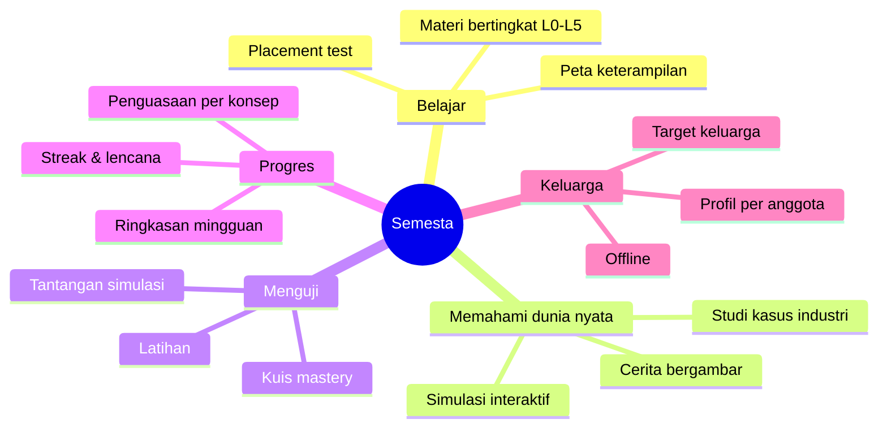

---

## 2. Latar Belakang & Problem Statement

### 2.1 Masalah yang ingin diselesaikan

| # | Masalah | Dampak |
|---|---|---|
| P1 | Materi fisika/matematika terpecah per jenjang; tidak ada jalur kontinu dari intuisi dasar sampai level riset | Orang berhenti belajar ketika "loncatan" ke level berikutnya terlalu besar |
| P2 | Materi terasa abstrak — tidak jelas kegunaannya | Motivasi rendah, "buat apa belajar ini?" |
| P3 | Simulasi (jika ada) terpisah dari teori dan soal latihan | Pemahaman tidak terhubung; simulasi jadi sekadar mainan |
| P4 | Progres belajar sulit dilihat, terutama untuk belajar mandiri | Sulit konsisten, tidak tahu sudah sampai mana |
| P5 | Satu keluarga berisi orang dengan tingkat berbeda, tetapi aplikasi belajar biasanya dirancang untuk satu segmen usia | Tidak bisa dipakai bersama |

### 2.2 Peluang

Dengan satu model konten berlapis (konsep → tingkat kedalaman → blok pelajaran) dan satu mesin simulasi yang dapat dipakai ulang, satu aplikasi dapat melayani rentang usia dan kemampuan yang lebar tanpa menduplikasi konten.

---

## 3. Visi, Tujuan, Non-Tujuan & Metrik Sukses

### 3.1 Visi

> Siapa pun, di usia berapa pun, bisa memahami cara kerja alam semesta lewat fisika dan matematika — dimulai dari rasa ingin tahu, sampai mampu berpikir seperti ilmuwan.

### 3.2 Tujuan Produk

| ID | Tujuan |
|---|---|
| G1 | Menyediakan jalur belajar berkelanjutan dari L0 (intuisi) sampai L5 (pemodelan/riset) untuk fisika dan matematika |
| G2 | Setiap pelajaran menghubungkan teori ke dunia nyata (cerita, simulasi, studi kasus industri) |
| G3 | Membuat progres belajar terlihat dan memotivasi untuk kembali |
| G4 | Dapat dipakai satu keluarga dengan profil terpisah, tetap berfungsi tanpa internet |
| G5 | Arsitektur dan kebijakan data siap dikembangkan ke Play Store tanpa rombak besar |

### 3.3 Non-Tujuan (versi 1.x)

- Bukan pengganti kurikulum/guru resmi; tidak mengeluarkan sertifikat.
- Bukan platform video-course; konten utama berbasis interaksi, bukan video panjang. (Video AI hanya untuk klip pendek non-materi: hook cerita, promosi, empty-state — lihat 6.9.)
- Tidak ada fitur sosial publik (komentar, chat, leaderboard global).
- Tidak ada tutor AI di v1 (dicatat sebagai ide fase lanjut).
- Tidak ada monetisasi di v1 (iklan, langganan, pembelian).

### 3.4 Metrik Sukses (hipotesis awal)

| Kategori | Metrik | Target MVP keluarga | Target awal Play Store |
|---|---|---|---|
| Aktivasi | % pengguna yang membuka katalog dan menyelesaikan 1 pelajaran dalam 7 hari pertama | ≥ 80% | ≥ 50% |
| Retensi | Pengguna aktif ≥ 3 hari/minggu selama 4 minggu | ≥ 50% anggota keluarga | D7 ≥ 25%, D30 ≥ 10% |
| Pembelajaran | Rata-rata skor kuis mastery | ≥ 70% | ≥ 70% |
| Pembelajaran | Kenaikan skor pre-test → post-test pada konsep yang sama | ≥ +20 poin | ≥ +15 poin |
| Engagement | Rata-rata simulasi dibuka per pelajaran | ≥ 1 | ≥ 1 |
| Kualitas teknis | Sesi bebas crash | ≥ 99% | ≥ 99,5% |
| Kualitas teknis | Frame rate simulasi di HP kelas menengah | ≥ 30 fps | ≥ 30 fps |
| Konten | Jumlah konsep terbit | 15 (MVP) → 30 (beta) | ≥ 50 |
| Kepuasan | Rating toko aplikasi | — | ≥ 4,3 |

---

## 4. Pengguna & Persona

Keputusan discovery: pengguna utama adalah **siapa saja**. Agar tetap terarah, pengguna dibagi ke empat persona berdasarkan *kebutuhan*, bukan semata usia.

| Persona | Profil | Kebutuhan & motivasi | Hambatan | Fitur kunci | Mode UI |
|---|---|---|---|---|---|
| **Kirana** (8–12 th) — Penjelajah | Pelajar SD/SMP awal, rasa ingin tahu tinggi | Belajar sambil bermain, penjelasan visual, tanpa rumus berat | Rentang perhatian pendek, belum lancar membaca teks panjang | Cerita bergambar, simulasi geser-lihat, kuis pendek dengan hadiah lencana | Mode Penjelajah: huruf besar, ikon besar, teks minim |
| **Dimas** (13–18 th) — Pelajar | SMP–SMA | Memahami konsep dan rumus, latihan soal, tahu gunanya | Rumus dihafal tanpa paham | Materi L2–L3, latihan, tantangan simulasi, studi kasus | Mode Pelajar: seimbang teks, rumus, visual |
| **Bu Ratna** (35–55 th) — Pembelajar dewasa / orang tua | Ingin menyegarkan ingatan atau mendampingi anak | Penjelasan intuitif, kaitan dengan kehidupan sehari-hari, tempo fleksibel | Waktu terbatas, malu bila tertinggal | Placement test, sesi 5–10 menit, cerita dan studi kasus | Mode Pelajar/Penjelajah (bebas pilih) |
| **Arya** (18–30 th) — Calon ilmuwan/insinyur | Mahasiswa atau profesional | Derivasi formal, matematika lanjut, studi kasus industri nyata, eksperimen numerik | Materi lanjut tersebar dan tidak interaktif | Materi L4–L5, simulasi dengan parameter penuh, sandbox (fase lanjut) | Mode Ahli: rumus dan derivasi penuh, data numerik |

**Prinsip "satu aplikasi, banyak kedalaman":** tingkat kedalaman **tidak dikunci berdasarkan usia**. Anak 10 tahun boleh naik ke L3 bila siap; orang dewasa boleh mulai dari L0. Usia hanya dipakai sebagai *rekomendasi awal* saat pembuatan profil.

### Use case per aktor

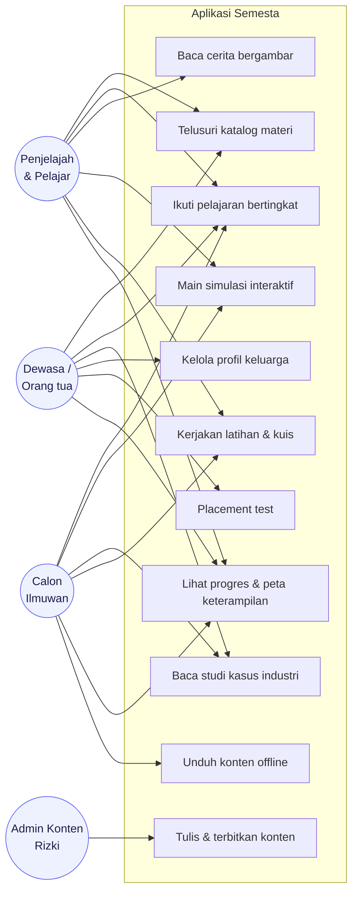

---

## 5. Ruang Lingkup & Prioritas (MoSCoW)

| Prioritas | Fitur |
|---|---|
| **Must** (MVP) | Katalog materi · materi bertingkat L0–L3 dengan prasyarat · cerita bergambar · simulasi interaktif · studi kasus industri · latihan & kuis mastery · progres (mastery, streak, peta keterampilan) · profil multi-pengguna lokal · offline & PWA |
| **Should** | Placement test · pengaturan & aksesibilitas · pengingat belajar · bookmark & catatan · ringkasan mingguan |
| **Could** | Akun & sinkronisasi antar-perangkat · target/papan keluarga (kolaboratif) · sandbox Python untuk level ilmuwan · CMS admin · simulasi 3D |
| **Won't** (v1) | Tutor AI · fitur sosial publik · monetisasi · multi-bahasa penuh · video-course · sertifikat |

### Tahapan rilis ringkas

| Rilis | Sasaran | Isi |
|---|---|---|
| **v0.1 Vertical slice** | Membuktikan alur end-to-end | 1 konsep lengkap (Gerak Parabola): cerita → simulasi → studi kasus → kuis → progres |
| **v1.0 MVP Keluarga** | Dipakai keluarga di HP | Semua fitur *Must*, ±15 konsep L0–L3 |
| **v1.5 Beta Keluarga** | Diperbaiki dari umpan balik | ±30 konsep, placement test, pengingat, ringkasan mingguan |
| **v2.0 Play Store** | Siap publik | Paket Android, akun + sinkronisasi, kebijakan privasi, closed testing |
| **v3.0** | Kedalaman penuh | L4–L5, sandbox Python, simulasi 3D, Inggris |

---

## 6. Struktur Konten & Kurikulum

Konten adalah produk inti. Bagian ini mendefinisikan modelnya agar konten dapat diproduksi secara konsisten.

### 6.1 Hierarki konten

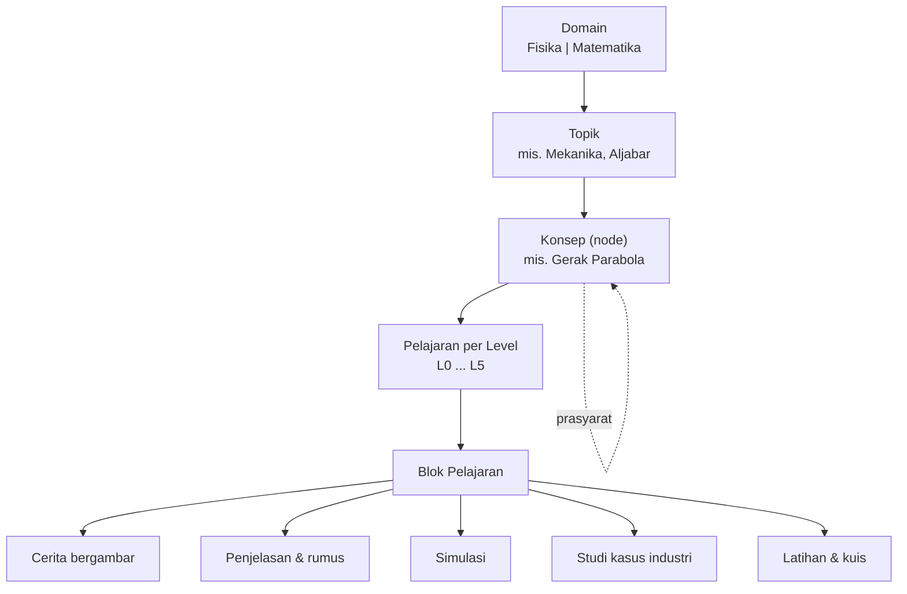

- **Konsep** adalah unit terkecil yang bisa "dikuasai". Konsep saling terhubung lewat **prasyarat** membentuk graf (DAG) — itulah **peta keterampilan**.
- Satu konsep dapat punya beberapa **pelajaran**, satu per tingkat kedalaman.
- Pelajaran tersusun dari **blok** yang dapat dipakai ulang antar-pelajaran (mis. satu simulasi dipakai di L1, L2, dan L3 dengan parameter berbeda).

### 6.2 Tingkat kedalaman (L0–L5)

| Level | Nama | Sasaran | Ciri konten | Contoh Fisika | Contoh Matematika |
|---|---|---|---|---|---|
| **L0** | Penjelajah (≈ 6–10 th) | Intuisi & rasa ingin tahu | Tanpa rumus; cerita + simulasi geser-lihat | "Kenapa bola jatuh?", cepat vs lambat | Pola, membilang, bentuk, perbandingan |
| **L1** | Dasar (≈ 10–13 th) | Konsep, satuan, hitung sederhana | Rumus satu langkah; satuan dikenalkan | Kecepatan = jarak/waktu, gaya dorong | Pecahan, rasio, persen, luas & keliling |
| **L2** | Menengah (≈ 13–16 th) | Rumus, grafik, soal cerita | Rumus bersyarat; grafik x–t dan v–t | GLBB, hukum Newton, energi & usaha | Persamaan linear/kuadrat, fungsi, trigonometri dasar |
| **L3** | Lanjut (≈ 16–18 th) | Model kuantitatif, kalkulus dasar | Vektor, turunan/integral sebagai alat | Gerak parabola vektor, momentum, listrik | Limit, turunan, integral, eksponen & logaritma, statistik |
| **L4** | Sarjana | Derivasi formal, persamaan diferensial | Bukti/derivasi, notasi formal | Osilasi teredam, gelombang, termodinamika, mekanika analitik (pengantar) | Persamaan diferensial biasa, aljabar linear, deret, bilangan kompleks |
| **L5** | Ilmuwan / Rekayasa | Pemodelan numerik, eksperimen komputasi, baca literatur | Sandbox, data nyata, studi kasus mendalam | Simulasi N-benda, metode numerik, elektrodinamika | Metode numerik, optimasi, probabilitas lanjut |

Rentang usia hanya panduan; pengguna bebas berpindah level. Setiap kenaikan level menampilkan prasyarat yang belum terpenuhi (tidak memblokir, hanya menyarankan).

### 6.3 Anatomi satu pelajaran (template)

Satu pelajaran idealnya berdurasi **5–20 menit** dan mengikuti urutan berikut (blok opsional bergantung level):

| # | Blok | Fungsi | L0–L1 | L2–L3 | L4–L5 |
|---|---|---|---|---|---|
| 1 | **Hook cerita** (komik 6–12 panel) | Membuka dengan situasi nyata | ✔ wajib | ✔ ringkas | opsional |
| 2 | **Intuisi** | Penjelasan tanpa rumus, analogi | ✔ | ✔ | ringkas |
| 3 | **Coba sendiri** (simulasi) | Eksplorasi parameter, menemukan pola | ✔ sederhana | ✔ | ✔ parameter penuh |
| 4 | **Konsep & rumus** | Definisi, rumus, satuan, grafik | minim | ✔ | ✔ + derivasi |
| 5 | **Contoh terpandu** | Soal dikerjakan langkah demi langkah | opsional | ✔ | ✔ |
| 6 | **Di dunia nyata** (studi kasus) | Aplikasi di industri/kehidupan | ✔ ringan | ✔ | ✔ mendalam |
| 7 | **Latihan** | Soal dengan petunjuk bertahap | ✔ | ✔ | ✔ |
| 8 | **Kuis mastery** | Mengukur penguasaan; memperbarui progres | ✔ 3 soal | ✔ 5 soal | ✔ 5–8 soal |
| 9 | **Ringkasan & lanjut** | Rekap + rekomendasi konsep berikutnya | ✔ | ✔ | ✔ |

### 6.4 Contoh peta keterampilan (graf prasyarat)

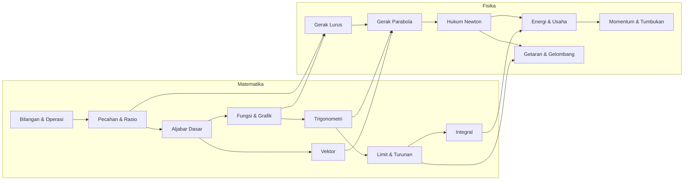

Graf ini menunjukkan keterkaitan lintas-domain: fisika dibangun di atas matematika, dan matematika diberi "alasan" lewat fisika.

### 6.5 Katalog konten MVP (target awal ±30 konsep; v1.0 mulai dari ±15)

| Domain | Konsep |
|---|---|
| **Fisika (12)** | Gerak & kecepatan · Jatuh bebas · Gerak parabola · Hukum Newton · Gesekan · Energi & usaha · Momentum & tumbukan · Gerak melingkar · Pegas & getaran · Gelombang · Listrik dasar (Hukum Ohm) · Cahaya & pemantulan |
| **Matematika (12)** | Bilangan & operasi · Pecahan & rasio · Pola & aljabar dasar · Persamaan linear · Fungsi & grafik · Persamaan kuadrat · Trigonometri dasar · Statistik & peluang dasar · Vektor · Eksponen & logaritma · Limit & turunan (pengantar) · Integral (pengantar) |
| **Lintas (6)** | Satuan & pengukuran · Membaca grafik · Notasi ilmiah · Estimasi (Fermi) · Model & simulasi · Galat & ketelitian |

### 6.6 Contoh pasangan konsep ↔ studi kasus industri

| Konsep | Studi kasus | Ide inti yang ditunjukkan |
|---|---|---|
| Gerak parabola | Lintasan semprotan air pemadam kebakaran / olahraga | Sudut & kecepatan awal menentukan jangkauan |
| Hukum Newton, momentum | Airbag & crumple zone mobil | Memperpanjang waktu tumbukan mengurangi gaya |
| Getaran & resonansi | Peredam getaran bangunan/jembatan | Frekuensi alami & redaman |
| Gelombang | Sonar & ultrasonografi | Pantulan gelombang untuk mengukur jarak/gambar |
| Listrik dasar | Rancangan baterai & kabel (rugi daya) | Hukum Ohm, daya, pemilihan penghantar |
| Logaritma | Skala desibel & Richter | Skala logaritmik untuk rentang besar |
| Turunan | Optimasi biaya/produksi | Mencari nilai maksimum/minimum |
| Trigonometri | Survei tanah, navigasi, GPS | Jarak dan sudut dari pengukuran tidak langsung |
| Statistik | Pengendalian kualitas pabrik | Variasi dan batas toleransi |
| Vektor | Grafik game 3D, navigasi drone | Arah dan besaran gerak |

**Aturan integritas studi kasus:** setiap angka/klaim memuat sumber atau ditandai jelas sebagai *model sederhana/asumsi*. Studi kasus tidak boleh menyajikan angka karangan sebagai fakta industri.

### 6.7 Spesifikasi cerita bergambar

| Aspek | Ketentuan |
|---|---|
| Format | Rangkaian **panel** (6–12 panel per cerita); tiap panel = gambar + teks narasi/balon dialog |
| Tokoh | Tokoh tetap lintas cerita (mis. keluarga fiktif: Kirana, Kakek, Dimas, Bu Ratna) agar konsisten dan akrab |
| Interaksi | Ketuk untuk lanjut; opsional 1–2 **titik keputusan** ("Menurutmu bola akan jatuh di mana?") yang terhubung ke simulasi |
| Gambar | SVG/WebP, gaya visual konsisten, alt-text wajib untuk setiap panel |
| Teks | Kalimat pendek; pada L0 boleh dibacakan (text-to-speech perangkat) — fase lanjut |
| Tujuan | Setiap cerita mengarah ke satu pertanyaan yang dijawab lewat simulasi/konsep |

**Contoh naskah singkat — "Bola Basket Kirana" (konsep: Gerak Parabola, L0–L1):**

| Panel | Visual | Narasi / dialog | Fungsi |
|---|---|---|---|
| 1 | Kirana di lapangan, memegang bola | "Kakek, kenapa bolaku tidak masuk ring?" | Hook |
| 2 | Bola dilempar lurus ke ring | Bola melengkung turun sebelum sampai | Fenomena |
| 3 | Kakek memperagakan lemparan lebih miring | "Coba miringkan lemparanmu." | Petunjuk |
| 4 | Dua lintasan berbeda (datar vs miring) | "Kenapa lintasannya melengkung?" | Pertanyaan inti |
| 5 | Ikon simulasi berkedip | "Ayo kita coba di simulator!" | Transisi ke simulasi |
| 6 | Bola masuk ring, Kirana melompat | "Ternyata sudutnya yang penting!" | Penutup |

### 6.8 Spesifikasi simulasi (MVP ±12)

| # | Simulasi | Tujuan belajar | Parameter | Keluaran |
|---|---|---|---|---|
| 1 | Gerak lurus | Hubungan posisi–kecepatan–waktu | v₀, a | Animasi + grafik x–t & v–t |
| 2 | Jatuh bebas | Pengaruh gravitasi | tinggi, g (Bumi/Bulan/Mars) | Waktu jatuh, kecepatan |
| 3 | Gerak parabola | Sudut & kecepatan awal → jangkauan | v₀, sudut, ketinggian awal | Lintasan, jangkauan maksimum |
| 4 | Hukum Newton | F = m·a, efek gesekan | gaya, massa, koefisien gesek | Percepatan, grafik v–t |
| 5 | Pegas & getaran | Hukum Hooke, periode | k, massa, redaman | Grafik simpangan, periode |
| 6 | Pendulum | Sudut kecil vs besar | panjang, sudut awal, g | Periode, energi |
| 7 | Gelombang | Frekuensi, amplitudo, superposisi | f, A, fase | Bentuk gelombang gabungan |
| 8 | Rangkaian listrik | Hukum Ohm, seri/paralel | V, R₁, R₂ | Arus, daya |
| 9 | Penjelajah fungsi | Efek parameter pada grafik | a, b, c (slider) | Grafik y = f(x) |
| 10 | Turunan & integral | Kemiringan & luas di bawah kurva | fungsi, titik x | Garis singgung, luas |
| 11 | Pecahan visual | Konsep pecahan (L0–L1) | pembagi, pembilang | Batang/lingkaran pecahan |
| 12 | Peluang | Hukum bilangan besar | jumlah percobaan | Histogram frekuensi |

**Kontrak setiap simulasi** (wajib dipenuhi):

- Mempunyai **tujuan belajar** tertulis satu kalimat.
- Parameter dapat diubah lewat slider/toggle dengan **satuan dan batas** jelas.
- Ada tombol **Mulai / Jeda / Reset**, dan tampilan **rumus terkait** (opsional per level).
- Menampilkan **metrik langsung** (HUD) dan/atau grafik.
- Mempunyai minimal 1 **tantangan** ("Buat bola mendarat di target 12 m") yang bisa dihubungkan ke kuis.
- Hasil numerik **diverifikasi** terhadap solusi analitik pada uji otomatis (Bagian 12).
- Menghormati pengaturan *reduce motion*; berhenti saat aplikasi di latar belakang.

### 6.9 Inventaris aset visual (AI-generated — keputusan 2 Okt 2026)

Seluruh aset visual pada aplikasi **wajib dibuat dengan AI** (gambar dan klip video pendek), kecuali ikon fungsional kecil yang lebih konsisten memakai set ikon vektor siap pakai (Heroicons/Phosphor, lisensi terbuka).

| # | Aset | Dipakai di | Format & batas | Catatan |
|---|---|---|---|---|
| V1 | Ilustrasi panel cerita | 6.7 — cerita bergambar | WebP, sisi panjang maks 1600px | Tokoh tetap (Kirana, Kakek, Dimas, Bu Ratna); gaya mengikuti panduan visual; alt-text wajib per panel |
| V2 | Ikon konsep (kartu katalog) | FR-01 | SVG diutamakan; bila AI: PNG 512px lalu tracing ke SVG | Satu set gaya garis konsisten |
| V3 | Avatar profil (set pilihan) | FR-08 | WebP/PNG 256px | Ramah anak, beragam; **tidak boleh menyerupai orang nyata** |
| V4 | Lencana pencapaian | FR-07 | SVG/WebP 256px | Gaya konsisten dengan V2 |
| V5 | Ilustrasi empty-state & ilustrasi bantu | Keadaan kosong, galat, hasil kosong | WebP ≤ 800px | Tone ringan, tidak menghakimi |
| V6 | Gambar studi kasus industri | FR-05 | WebP ≤ 1200px | Ilustrasi, bukan foto berhak cipta; **angka pada gambar tidak menggantikan angka bersumber di teks** |
| V7 | Diagram penjelasan dalam pelajaran | Blok konsep & rumus | SVG (AI lalu tracing/rapikan manual) | Rumus tetap di-render KaTeX — **AI tidak menggambar rumus/teks/angka** (rawan salah) |
| V8 | Ilustrasi onboarding & splash | Layar pembuka, splash PWA | WebP/PNG ≤ 1200px | — |
| V9 | Aset toko Play Store | 13.2 | Ikon 512×512, feature graphic 1024×500, tangkapan layar | Dibuat menjelang M4; gaya selaras aplikasi |
| V10 | Klip video pendek | Hook cerita (5–15 dtk), promosi, empty-state | MP4/WebM ≤ 10 detik, **lazy-load**, tidak di-precache | **Bukan materi pelajaran** (lihat 3.3); hormati *reduce motion* — sediakan versi diam |

**Aturan umum:**
- Satu **panduan visual** (gaya, palet, lembar karakter) dikunci sebelum produksi massal; setiap prompt generate merujuknya.
- Setiap aset tercatat di `content/assets/ASSET_LOG.md`: prompt/seed, alat, tanggal, ketentuan lisensi alat, alt-text.
- Teks, rumus, dan angka pada aset pelajaran selalu overlay dari UI/KaTeX agar akurat dan dapat diterjemahkan.
- Aset video tidak masuk paket konten offline dasar; diunduh terpisah/on-demand agar tidak membengkakkan paket 15 MB.
- **Aturan "level dial":** gaya master **flat vector ceria** dipakai di semua level. L0–L1 boleh lebih bulat, cerah, dan sederhana (latar minimal); L2–L3 gaya standar; L4–L5 tetap flat vector tetapi lebih teknis (aksen isometrik/blueprint, palet sedikit lebih kalem). Tokoh dan bahasa visual tidak berubah — hanya kepadatan detail dan suasana.

---

## 7. Kebutuhan Fungsional

Ringkasan seluruh kebutuhan fungsional (detail acceptance criteria untuk fitur *Must* ada di 7.1).

| ID | Fitur | Prioritas | Fase |
|---|---|---|---|
| FR-01 | Katalog materi | Must | MVP |
| FR-02 | Materi bertingkat & jalur belajar | Must | MVP |
| FR-03 | Cerita bergambar | Must | MVP |
| FR-04 | Simulasi interaktif | Must | MVP |
| FR-05 | Studi kasus industri | Must | MVP |
| FR-06 | Latihan & kuis mastery | Must | MVP |
| FR-07 | Progres & statistik | Must | MVP |
| FR-08 | Profil multi-pengguna keluarga | Must | MVP |
| FR-09 | Offline & instalasi PWA | Must | MVP |
| FR-10 | Placement test | Should | Beta |
| FR-11 | Pengaturan & aksesibilitas | Should | MVP/Beta |
| FR-12 | Pengingat belajar | Should | Beta |
| FR-13 | Bookmark & catatan | Should | Beta |
| FR-14 | Akun & sinkronisasi | Could | Play Store |
| FR-15 | Target keluarga (kolaboratif) | Could | Beta+ |
| FR-16 | Sandbox ilmuwan (Python di browser) | Could | v3 |
| FR-17 | CMS admin konten | Could | v2+ |
| FR-18 | Multi-bahasa | Won't (v1) | v3 |
| FR-19 | Tutor AI | Won't (v1) | Ide lanjut |

### 7.1 Detail fitur *Must*

#### FR-01 Katalog Materi *(aksi pertama pengguna)*

**Deskripsi:** Layar pertama setelah aplikasi dibuka adalah katalog materi. Pengguna dapat menjelajah tanpa login dan tanpa internet (setelah konten ter-cache).

**Kebutuhan:**
- Bagian teratas: **"Lanjutkan belajar"** (pelajaran terakhir yang belum selesai), lalu **"Rekomendasi untukmu"**.
- Kartu konsep menampilkan: ikon, judul, level tersedia, perkiraan durasi, cincin progres, penanda tipe konten (cerita / simulasi / studi kasus).
- Filter: domain (Fisika/Matematika), level (L0–L5), tipe konten, status (belum mulai / berjalan / selesai).
- Pencarian teks pada judul dan kata kunci konsep.
- Pengurutan: rekomendasi (default), A–Z, level.

**Acceptance criteria:**
- Katalog tampil dalam ≤ 1 detik pada peluncuran kedua (dari cache).
- Dapat dibuka dan difilter dalam mode offline.
- Kombinasi filter bekerja bersamaan; hasil kosong menampilkan keadaan kosong yang ramah.
- Seluruh konsep terbit muncul, termasuk yang prasyaratnya belum terpenuhi (ditandai, tidak disembunyikan).

#### FR-02 Materi Bertingkat & Jalur Belajar

**Deskripsi:** Setiap konsep punya pelajaran per level; konsep terhubung lewat prasyarat pada peta keterampilan.

**Kebutuhan:**
- Pemilih level pada halaman konsep (L0–L5, hanya yang tersedia yang aktif).
- Peta keterampilan interaktif (zoom/geser) dengan status warna per konsep.
- Prasyarat belum terpenuhi → tampilkan saran ("Disarankan selesaikan *Pecahan & Rasio* dulu") tanpa memblokir.
- Jalur belajar rekomendasi berdasarkan progres dan hasil placement test.

**Acceptance criteria:**
- Mengganti level mempertahankan posisi pengguna di dalam konsep yang sama bila memungkinkan.
- Peta memuat ≥ 30 node tanpa penurunan fps di perangkat menengah.
- Status konsep mengikuti diagram status pada Bagian 10.8.

#### FR-03 Cerita Bergambar

**Kebutuhan:** penampil panel (geser/ketuk), balon dialog, alt-text, titik keputusan opsional, tombol "lewati ke simulasi", indikator posisi panel, mode gelap.

**Acceptance criteria:**
- Panel berikutnya dimuat sebelum pengguna sampai (pre-fetch) — tidak ada jeda terlihat.
- Menyelesaikan cerita tercatat di progres pelajaran.
- Seluruh gambar memiliki teks alternatif; teks dapat diperbesar sampai 200% tanpa terpotong.

#### FR-04 Simulasi Interaktif

**Kebutuhan:** mengikuti kontrak simulasi (Bagian 6.8): parameter berbatas dan berbentuk satuan, mulai/jeda/reset, HUD metrik, grafik, tantangan, rumus terkait.

**Acceptance criteria:**
- ≥ 30 fps stabil di perangkat kelas menengah (target 60 fps) dengan dukungan penurunan kualitas otomatis.
- Perubahan parameter tercermin ≤ 100 ms.
- Hasil numerik cocok dengan solusi analitik sesuai toleransi uji (Bagian 12).
- Layar tetap responsif saat rotasi; posisi kontrol nyaman dijangkau satu tangan.

#### FR-05 Studi Kasus Industri

**Struktur wajib:** Konteks → Masalah → Konsep yang dipakai → Angka/model → Simulasi mini "Jadi insinyur" → Dampak → Karier terkait → Sumber.

**Acceptance criteria:**
- Setiap angka memiliki sumber atau label *model/asumsi*.
- Terhubung dua arah: dari pelajaran → studi kasus, dan dari studi kasus → konsep terkait.
- Dapat dibaca offline.

#### FR-06 Latihan & Kuis Mastery

**Jenis soal:**

| Jenis | Keterangan |
|---|---|
| Pilihan ganda | 1 jawaban benar; pengecoh dirancang dari miskonsepsi umum |
| Isian angka | Toleransi dan satuan dapat dikonfigurasi |
| Urutkan langkah | Menyusun langkah penyelesaian |
| Seret & cocokkan | Menghubungkan istilah/grafik/rumus |
| Baca grafik | Menjawab dari grafik yang ditampilkan |
| **Tantangan simulasi** | Atur parameter simulasi hingga mencapai target |

**Kebutuhan:**
- Petunjuk bertahap (maks. 3 tingkat); pemakaian petunjuk mengurangi poin secara ringan, tidak menghukum.
- Penjelasan setelah setiap jawaban (benar maupun salah).
- Kuis mastery: 3–8 soal (bergantung level), diacak dari bank soal (≥ 2× jumlah soal yang ditampilkan agar bisa diulang).
- Pengulangan berjarak (spaced repetition) ringan untuk konsep yang mulai "memudar".

**Acceptance criteria:**
- Skor dan mastery tersimpan lokal segera setelah kuis selesai (tanpa perlu internet).
- Soal isian angka menerima format desimal koma/titik dan notasi ilmiah.
- Setiap soal memiliki penjelasan; tidak ada soal tanpa `explanation`.

#### FR-07 Progres & Statistik *(alasan pengguna kembali)*

**Komponen:**

| Komponen | Isi |
|---|---|
| **Peta keterampilan** | Node berwarna sesuai status konsep (terkunci-saran / terbuka / sedang / dikuasai / perlu diulang) |
| **Mastery per konsep** | Persentase penguasaan (0–100%) dengan riwayat tren |
| **Streak** | Hari beruntun belajar; 1 "hari libur" per minggu tidak memutus streak (pemaaf) |
| **XP & level pengguna** | Poin dari aktivitas; level profil (bukan level kedalaman) |
| **Lencana** | Pencapaian (mis. "Pemburu Parabola", "7 hari beruntun", "Menguasai 5 konsep") |
| **Ringkasan mingguan** | Waktu belajar, konsep baru, konsep dikuasai, rekomendasi |
| **Riwayat** | Linimasa aktivitas |

**Acceptance criteria:**
- Dasbor progres terbuka ≤ 1 detik dan konsisten dengan data lokal.
- Setiap penyelesaian pelajaran/kuis langsung memperbarui progres, tanpa muat ulang.
- Rumus mastery dan streak terdokumentasi (Bagian 10.8) dan diuji unit.

#### FR-08 Profil Multi-Pengguna Keluarga

**Kebutuhan:**
- Beberapa profil pada satu perangkat (nama, avatar, tanggal lahir/rentang usia opsional, mode UI default).
- Tanpa login pada MVP; pemilih profil pada saat dibuka (seperti profil di layanan streaming).
- Progres dan pengaturan terpisah per profil.
- Profil anak: tautan keluar dan pengaturan dilindungi *parental gate* sederhana (soal hitung).
- Ekspor/impor data profil ke berkas (cadangan; berguna untuk pindah HP atau bila penyimpanan browser terhapus).

**Acceptance criteria:**
- Berpindah profil ≤ 500 ms tanpa menutup aplikasi.
- Menghapus profil membutuhkan konfirmasi dan menghapus seluruh data profil itu saja.
- Ekspor menghasilkan berkas JSON yang bisa diimpor ulang tanpa kehilangan data.

#### FR-09 Offline & Instalasi PWA

**Kebutuhan:** aplikasi dapat dipasang ke layar utama; *app shell* dan paket konten tersimpan offline; unduhan konten per topik dengan indikator ukuran; pembaruan konten berjalan di latar belakang dan diterapkan saat pengguna menutup pelajaran.

**Acceptance criteria:**
- Setelah kunjungan pertama, seluruh fitur MVP berfungsi dalam mode pesawat untuk konten yang telah diunduh.
- Pengguna dapat melihat, mengunduh, dan menghapus paket konten per topik.
- Pembaruan aplikasi tidak menghapus progres.

### 7.2 Fitur *Should / Could* (ringkas)

| ID | Deskripsi singkat | Catatan |
|---|---|---|
| FR-10 Placement test | 8–12 soal adaptif per domain untuk menentukan level awal; hasil = rekomendasi jalur, bukan penghalang | Penting untuk klaim "nol sampai ahli" |
| FR-11 Pengaturan | Ukuran huruf, tema terang/gelap/otomatis, reduce motion, suara, mode UI (Penjelajah/Pelajar/Ahli) | Aksesibilitas WCAG 2.2 AA |
| FR-12 Pengingat | Notifikasi lokal jadwal belajar; lembut, mudah dimatikan | PWA di iPhone perlu terpasang di layar utama |
| FR-13 Bookmark & catatan | Menandai pelajaran/rumus; catatan singkat per konsep | Disimpan lokal per profil |
| FR-14 Akun & sinkronisasi | Login (email/Google), sinkronisasi profil & progres antar-perangkat | Prasyarat Play Store; arsitektur local-first |
| FR-15 Target keluarga | Target mingguan bersama (mis. 10 pelajaran per keluarga), tanpa peringkat kompetitif | Menguatkan kebiasaan keluarga |
| FR-16 Sandbox ilmuwan | Editor Python di browser (Pyodide) dengan NumPy/Matplotlib untuk eksperimen L5 | Berat (unduhan besar); opsional |
| FR-17 CMS admin | Antarmuka penulisan konten | MVP cukup via Git + MDX |

---

## 8. Kebutuhan Non-Fungsional

| Kategori | Kebutuhan | Target awal |
|---|---|---|
| **Performa** | Waktu sampai interaktif pada HP kelas menengah, jaringan 4G | ≤ 3 detik (kunjungan pertama), ≤ 1 detik (berikutnya) |
| | Frame rate simulasi | ≥ 30 fps (target 60); penurunan kualitas otomatis |
| | Ukuran *app shell* (gzip) | ≤ 2 MB |
| | Ukuran paket konten per topik | ≤ 15 MB (gambar dioptimalkan WebP/SVG) |
| **Offline** | Fitur MVP berfungsi tanpa internet untuk konten terunduh | 100% fitur *Must* |
| **Kompatibilitas** | Android (Chrome/WebView modern), iPhone (Safari, PWA terpasang) | Android 8+, iOS 16.4+ |
| | Ukuran layar | 360 × 640 dp sampai tablet; orientasi potret & lanskap |
| **Aksesibilitas** | Standar | WCAG 2.2 AA sebagai target |
| | Rincian | Huruf dapat diperbesar sampai 200%; kontras cukup; alt-text; dukungan pembaca layar; tidak mengandalkan warna saja; *reduce motion* |
| **Keandalan** | Sesi bebas crash | ≥ 99% |
| | Integritas data | Tidak ada kehilangan progres saat pembaruan aplikasi; transaksi tulis atomik |
| **Privasi & keamanan** | Data minimal | Tanpa data pribadi wajib di MVP; data tersimpan di perangkat |
| | Pihak ketiga | Tanpa iklan dan tanpa pelacak pihak ketiga pada v1 |
| | Anak | *Parental gate* untuk tautan keluar dan pengaturan |
| | Backend (Fase 2) | TLS, hashing kata sandi (Argon2), rate limiting, validasi input, cadangan basis data |
| **Keterpeliharaan** | Konten terpisah dari kode | Konten sebagai MDX/JSON tervalidasi skema |
| | Kualitas kode | TypeScript strict, lint & format otomatis, CI wajib hijau |
| | Cakupan uji | Engine simulasi & progres ≥ 80% |
| **Lokalisasi** | Siap multi-bahasa | Seluruh teks UI di berkas i18n dari awal (default Indonesia) |
| **Skalabilitas konten** | Penambahan konsep baru tanpa mengubah kode inti | Cukup menambah berkas konten + mendaftarkan simulasi |

---

## 9. UX, Navigasi & Wireframe

### 9.1 Prinsip desain

1. **Katalog dulu.** Tidak ada layar login/onboarding panjang sebelum pengguna melihat isi.
2. **Satu ibu jari.** Navigasi utama dan kontrol simulasi berada di area yang mudah dijangkau.
3. **Sentuh, lalu paham.** Interaksi mendahului teks; teks pendek dan bertahap.
4. **Kedalaman adaptif.** Mode Penjelajah/Pelajar/Ahli mengubah kepadatan informasi, bukan menutup akses.
5. **Progres selalu terlihat, tidak menghakimi.** Bahasa positif; streak pemaaf.
6. **Ramah keluarga.** Profil, warna, dan bahasa yang nyaman untuk semua usia.

### 9.2 Peta navigasi

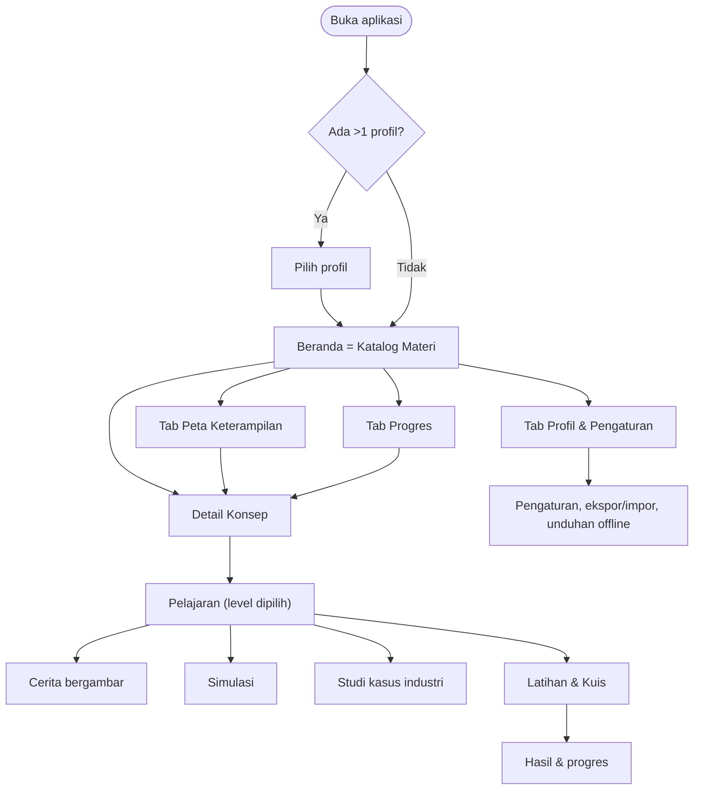

Bilah navigasi bawah (4 tab): **Katalog · Peta · Progres · Profil**.

### 9.3 Wireframe (low-fidelity)

**Katalog (beranda)**

```
┌──────────────────────────────┐
│ Halo, Kirana!        🔥 5 hari│
│ [🔍 Cari konsep...          ]│
├──────────────────────────────┤
│ Lanjutkan belajar            │
│ ┌──────────────────────────┐ │
│ │ Gerak Parabola · L2      │ │
│ │ ▓▓▓▓▓▓░░░░  60%   ▶      │ │
│ └──────────────────────────┘ │
│ [Semua][Fisika][Matematika]  │
│ [L0][L1][L2][L3]...          │
│ ┌────────┐ ┌────────┐        │
│ │ ◔ Gerak│ │ ◑ Pecah│        │
│ │ lurus  │ │ an     │        │
│ │ 📖🎮   │ │ 📖🎮🏭 │        │
│ └────────┘ └────────┘        │
├──────────────────────────────┤
│ Katalog  Peta  Progres  Profil│
└──────────────────────────────┘
```

**Pelajaran (dengan simulasi)**

```
┌──────────────────────────────┐
│ ←  Gerak Parabola   [L2 ▾]   │
│ ● ● ○ ○ ○ ○   (langkah 3/6)  │
├──────────────────────────────┤
│   [ area simulasi / kanvas ] │
│      ·  ·                    │
│    ·      ·      🎯          │
│  ●                           │
│  Sudut  ───●──── 45°         │
│  Kec.   ──────●─ 20 m/s      │
│  Jangkauan: 40,8 m           │
│  [▶ Mulai] [⏸] [↺ Reset]     │
│  ▸ Lihat rumus               │
├──────────────────────────────┤
│        [ Lanjut → ]          │
└──────────────────────────────┘
```

**Progres**

```
┌──────────────────────────────┐
│ Progresmu      Minggu ini ▾  │
│ 🔥 5 hari   ⭐ 1.240 XP  Lv 6 │
│ Waktu belajar: 2 j 15 m      │
├──────────────────────────────┤
│ Penguasaan konsep            │
│ Gerak lurus      ▓▓▓▓▓▓▓▓ 92%│
│ Gerak parabola   ▓▓▓▓▓░░░ 61%│
│ Pecahan          ▓▓▓▓▓▓▓░ 78%│
│ ⚠ Perlu diulang: Persen      │
├──────────────────────────────┤
│ Lencana: 🏅 🏅 🏅 ⬜ ⬜        │
└──────────────────────────────┘
```

### 9.4 Mode UI adaptif

| Aspek | Penjelajah | Pelajar | Ahli |
|---|---|---|---|
| Ukuran huruf & ikon | Besar | Sedang | Sedang |
| Kepadatan teks | Sangat rendah | Sedang | Tinggi |
| Rumus | Disembunyikan/visual | Ditampilkan | Ditampilkan + derivasi |
| Simulasi | Parameter terbatas | Parameter utama | Parameter penuh + data |
| Bahasa | Sederhana, akrab | Netral | Teknis |

Mode dapat diubah kapan saja; **mode tidak membatasi level** yang dapat diakses.

---

## 10. Arsitektur, Tech Stack & Desain Teknis

### 10.1 Keputusan arsitektur utama (ADR ringkas)

| ID | Keputusan | Alasan | Alternatif yang dipertimbangkan |
|---|---|---|---|
| ADR-01 | **PWA-first** (web app yang dapat dipasang), dibungkus **Capacitor** saat ke Play Store | Satu basis kode untuk Android dan iPhone; keluarga cukup membuka tautan tanpa APK; ekosistem simulasi & rendering matematika di web sangat kaya (KaTeX, Canvas/WebGL, Three.js) | Flutter (performa kanvas sangat baik, tetapi bahasa Dart baru dan ekosistem matematika lebih kecil); React Native; Kotlin native (hanya Android) |
| ADR-02 | **Offline-first, tanpa backend pada MVP** | Menghilangkan biaya server dan kompleksitas; cocok untuk pemakaian keluarga; progres tersimpan lokal | Firebase/Supabase sejak awal |
| ADR-03 | **Konten sebagai kode** (MDX + frontmatter di Git, divalidasi skema) | Versi terkontrol, mudah ditinjau, tidak butuh CMS pada MVP, konten dan kode dapat dirilis terpisah | Headless CMS (Strapi, Sanity) — ditunda ke v2+ |
| ADR-04 | **Simulasi = komponen TypeScript** dengan engine numerik sendiri (RK4) | Kontrol penuh atas akurasi dan performa; dapat diuji terhadap solusi analitik; tanpa ketergantungan runtime berat | Game engine (Unity/Godot — terlalu berat), iframe eksternal (PhET) — lisensi & offline sulit |
| ADR-05 | **Profil lokal tanpa login** pada MVP; akun opsional di Fase 2 | Hambatan masuk nol untuk keluarga; akun baru dibutuhkan untuk Play Store & sinkronisasi | Login wajib sejak awal |
| ADR-06 | **Backend Python (FastAPI) + PostgreSQL** pada Fase 2 | Sejalan dengan keahlian Python; API cepat, tervalidasi (Pydantic), dokumentasi OpenAPI otomatis | Supabase/Firebase (lebih cepat, tetapi kontrol & portabilitas lebih rendah) |
| ADR-07 | **Web Worker** untuk simulasi berat | Menjaga UI tetap responsif di perangkat murah | Semua di main thread |

> Jika Anda lebih nyaman dengan Flutter, seluruh desain domain (model konten, progres, simulasi berbasis `step()` deterministik, sinkronisasi) tetap berlaku; hanya lapisan UI/renderer yang diganti.

### 10.2 Tech stack

| Lapisan | Pilihan | Catatan |
|---|---|---|
| **Bahasa** | TypeScript (strict) | Frontend; Python 3.12+ untuk backend |
| **Framework UI** | React + Vite | Alternatif setara: Vue 3, Svelte |
| **Styling** | Tailwind CSS + Radix UI (primitif aksesibel) | Token desain untuk 3 mode UI |
| **Animasi** | Motion (Framer Motion) + CSS | Hormati *reduce motion* |
| **State** | Zustand (klien); TanStack Query (Fase 2, data server) | |
| **Routing** | React Router / TanStack Router | Rute per konsep/level |
| **Konten** | MDX + frontmatter YAML, skema Zod | Dibangun jadi *content pack* JSON |
| **Rumus** | KaTeX | Render cepat & offline |
| **Grafik data** | uPlot (ringan) atau Recharts | Grafik x–t, v–t, histogram |
| **Grafik matematika** | Mafs atau JSXGraph | Fungsi, garis singgung, luas |
| **Simulasi 2D** | Canvas 2D + engine numerik sendiri; Matter.js untuk tumbukan benda tegar | |
| **Simulasi 3D** *(v3)* | Three.js / react-three-fiber | |
| **Penyimpanan lokal** | IndexedDB melalui Dexie | Profil, progres, riwayat kuis |
| **PWA** | vite-plugin-pwa (Workbox) | Precache app shell + paket konten |
| **Pembungkus Android** | Capacitor | Alternatif: TWA (Bubblewrap) |
| **Backend (Fase 2)** | FastAPI, Pydantic v2, SQLAlchemy 2, Alembic | |
| **Basis data (Fase 2)** | PostgreSQL | |
| **Auth (Fase 2)** | JWT + OAuth Google | |
| **Hosting** | Frontend: Cloudflare Pages / Netlify / Vercel; Backend: VPS kecil / Fly.io / Railway; DB: Postgres terkelola | Cek batas gratis saat setup |
| **CI/CD** | GitHub Actions | Lint, uji, build, deploy pratinjau |
| **Pengujian** | Vitest, Testing Library, Playwright (viewport mobile), pytest, Lighthouse CI | |
| **Pemantauan** | Sentry (kesalahan; opt-in) | |
| **Desain & ilustrasi** | Figma, Inkscape/Krita (SVG/WebP) | Periksa lisensi bila memakai ilustrasi AI/stok |
| **Lingkungan dev** | Windows + VS Code, Node.js LTS, pnpm, Python 3.12, Docker Desktop (WSL2), Android Studio (untuk Capacitor) | Versi pasti dikunci saat setup proyek |

### 10.3 Arsitektur sistem

**Fase 1 — MVP (offline-first, tanpa backend)**

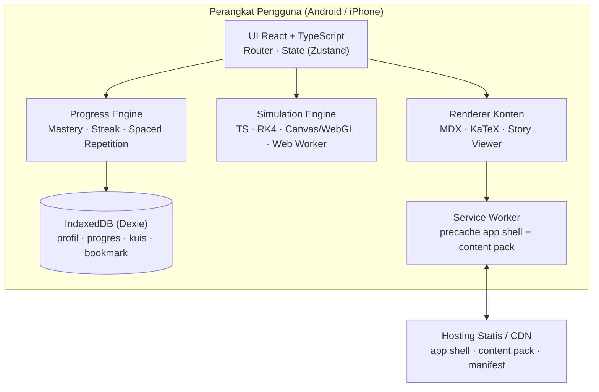

**Fase 2 — Play Store (menambah akun & sinkronisasi)**

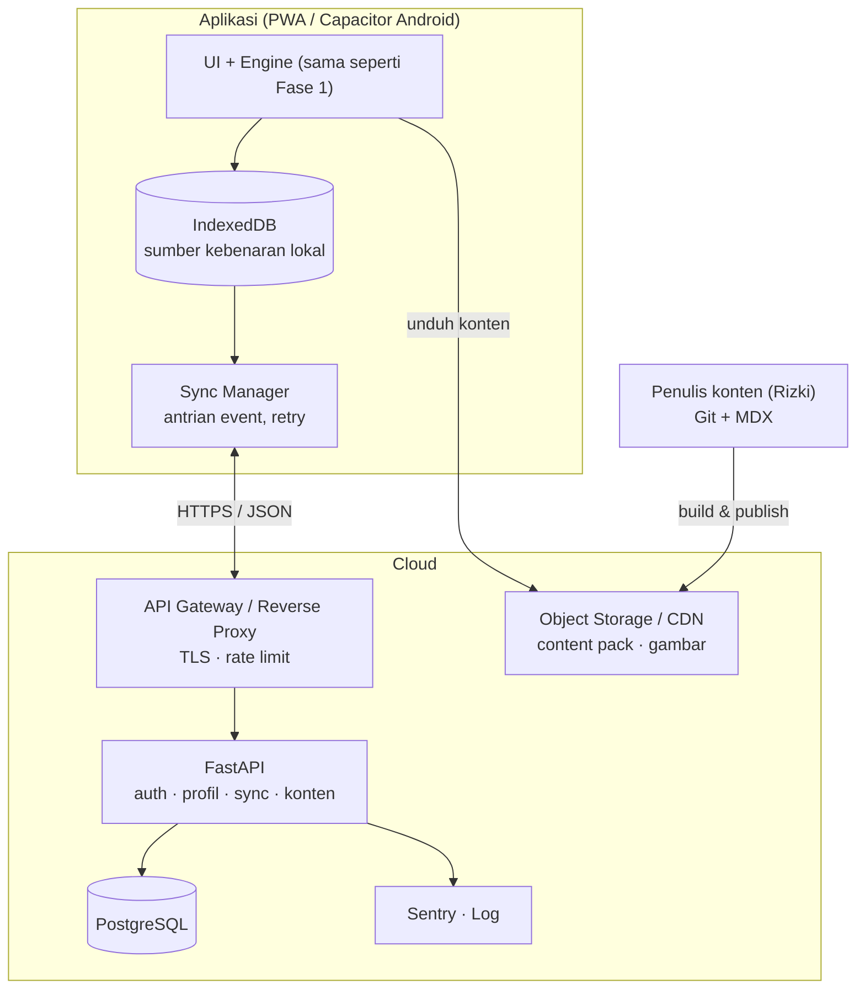

### 10.4 Struktur repositori (monorepo)

```
semesta/
├── apps/
│   ├── web/                    # PWA React + Vite
│   │   ├── src/
│   │   │   ├── app/            # routing, layout, providers
│   │   │   ├── features/
│   │   │   │   ├── catalog/    # FR-01
│   │   │   │   ├── skillmap/   # FR-02
│   │   │   │   ├── lesson/     # renderer blok
│   │   │   │   ├── story/      # FR-03
│   │   │   │   ├── simulation/ # host + registry
│   │   │   │   ├── casestudy/  # FR-05
│   │   │   │   ├── quiz/       # FR-06
│   │   │   │   ├── progress/   # FR-07
│   │   │   │   └── profiles/   # FR-08
│   │   │   ├── db/             # skema Dexie, migrasi
│   │   │   ├── i18n/           # teks UI (id, en)
│   │   │   └── pwa/            # service worker, strategi cache
│   │   └── public/
│   └── api/                    # FastAPI (Fase 2)
├── packages/
│   ├── sim-engine/             # integrator numerik, loop, HUD (tanpa React)
│   ├── simulations/            # sim-projectile, sim-pendulum, ...
│   ├── progress-core/          # mastery, streak, SRS (murni, teruji)
│   ├── content-schema/         # skema Zod: konsep, pelajaran, soal
│   └── ui/                     # komponen desain bersama
├── content/
│   ├── fisika/mekanika/gerak-parabola/{l0,l1,l2,l3}.mdx
│   ├── matematika/aljabar/...
│   ├── stories/                # naskah + aset panel
│   ├── case-studies/
│   ├── quizzes/                # bank soal (JSON/YAML)
│   └── skill-graph.yaml        # daftar konsep & prasyarat
├── tools/
│   └── build-content/          # validasi + bundling ke content pack
└── .github/workflows/
```

Aturan ketergantungan: `sim-engine` dan `progress-core` **tidak boleh** bergantung pada React atau DOM, agar mudah diuji dan dapat dipindah ke framework lain.

### 10.5 Desain engine simulasi

**Kontrak simulasi (TypeScript):**

```ts
interface Simulation<P, S> {
  id: string;
  learningGoal: string;
  params: ParamSpec<P>;                       // slider/toggle: min, max, step, satuan
  init(p: P): S;                              // keadaan awal
  step(s: S, dt: number, p: P): S;            // maju sebesar dt tetap (deterministik)
  draw(ctx: CanvasRenderingContext2D, s: S, p: P): void;
  metrics(s: S, p: P): Record<string, number>; // untuk HUD & grafik
  challenges?: Challenge<S>[];                // tantangan → dapat dipakai kuis
}
```

**Prinsip:**

| Aspek | Keputusan |
|---|---|
| Integrasi numerik | Runge–Kutta orde 4 (RK4) untuk sistem dinamis (pendulum, pegas teredam, orbit); rumus tertutup untuk kasus analitik sederhana (parabola tanpa hambatan) |
| Loop waktu | *Fixed timestep* dengan akumulator (mis. dt = 1/240 s untuk sistem kaku), render pada `requestAnimationFrame` dengan interpolasi |
| Determinisme | `step()` fungsi murni tanpa `Math.random()` tanpa seed → mudah diuji dan direproduksi |
| Performa | Simulasi berat dijalankan di Web Worker (Comlink); kualitas turun otomatis (kurangi partikel/resolusi kanvas) bila fps < 30 |
| Keterbacaan | Semua besaran memakai SI; satuan selalu tampil |
| Aksesibilitas | Kontrol dapat dioperasikan keyboard/pembaca layar; hasil dijelaskan dalam teks ("Bola mendarat pada jarak 40,8 m") |
| Siklus hidup | Jeda otomatis ketika aplikasi di latar belakang; berhenti saat komponen dilepas |

**Validasi numerik (uji otomatis):**

| Simulasi | Pembanding | Toleransi |
|---|---|---|
| Gerak parabola tanpa hambatan | Rumus jangkauan R = v₀² sin(2θ)/g | galat relatif < 10⁻⁶ |
| Pendulum (RK4) | Kekekalan energi mekanik | penyimpangan < 0,1% per 10 detik simulasi |
| Pegas teredam | Solusi analitik osilator teredam | galat relatif < 10⁻⁴ |
| Jatuh bebas | h = ½ g t² | galat relatif < 10⁻⁶ |

### 10.6 Format konten & *content pack*

**Berkas pelajaran (`gerak-parabola/l2.mdx`):**

```mdx
---
id: fis-gerak-parabola
level: L2
domain: fisika
topic: mekanika
title: Gerak Parabola
prerequisites: [fis-kinematika-dasar, mat-trigonometri-dasar]
estMinutes: 18
story: story-bola-basket-kirana
simulations: [sim-projectile]
caseStudies: [cs-semprotan-pemadam]
quiz: quiz-fis-gerak-parabola-l2
version: 3
---

<Story id="story-bola-basket-kirana" />

## Intuisi
Gerak parabola adalah gabungan dua gerak yang berjalan bersamaan ...

<Sim id="sim-projectile" preset="l2" />

## Rumus
<Formula>{`R = \\frac{v_0^2 \\sin 2\\theta}{g}`}</Formula>

<WorkedExample id="ex-1" />
<CaseStudy id="cs-semprotan-pemadam" />
<Quiz id="quiz-fis-gerak-parabola-l2" />
```

**Bank soal (`quizzes/quiz-fis-gerak-parabola-l2.yaml`):**

```yaml
- id: q1
  type: numeric
  prompt: "Bola ditendang dengan v₀ = 20 m/s pada sudut 30°. Berapa jangkauan (g = 9,8 m/s²)?"
  answer: 35.3
  tolerance: 0.5
  unit: m
  hints:
    - "Gunakan R = v₀² sin(2θ) / g"
    - "sin 60° ≈ 0,866"
  explanation: "R = 20² × 0,866 / 9,8 ≈ 35,3 m."
  misconception: "Menganggap sudut 45° selalu memberi jarak terjauh untuk semua kondisi."
  difficulty: 2
  concept: fis-gerak-parabola
```

**Skema validasi:** semua berkas divalidasi oleh `content-schema` (Zod) pada saat build: `id` unik, prasyarat merujuk konsep yang ada, setiap soal punya `explanation`, setiap gambar punya `alt`, tidak ada siklus pada graf prasyarat. Build **gagal** bila ada pelanggaran.

**Content pack:** hasil build berupa `manifest.json` (versi, daftar paket, ukuran, hash) + paket JSON per topik. Pembaruan konten hanya mengunduh paket yang berubah.

### 10.7 Model data

**ERD logis (konten statis + data pengguna):**

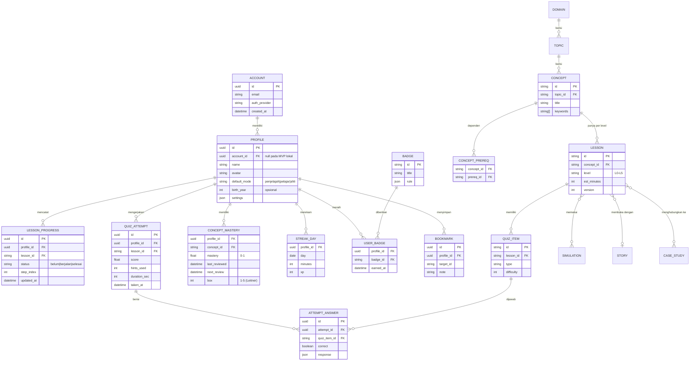

**Catatan implementasi:**
- Entitas konten (`DOMAIN`, `TOPIC`, `CONCEPT`, `LESSON`, `QUIZ_ITEM`, `SIMULATION`, `STORY`, `CASE_STUDY`) berasal dari *content pack*, **bukan** disimpan di IndexedDB pengguna; hanya rujukan `id` yang disimpan pada data progres.
- `id` memakai UUID v4 (atau ULID) yang dibuat di klien agar sinkronisasi antar-perangkat bebas bentrok.
- Setiap tabel data pengguna memiliki `updated_at` dan `deleted_at` (penghapusan lunak) untuk sinkronisasi.
- Skema IndexedDB memakai versi dengan migrasi (Dexie `version().upgrade()`); migrasi wajib diuji.

### 10.8 Logika progres, mastery & streak

**Status konsep (state machine):**

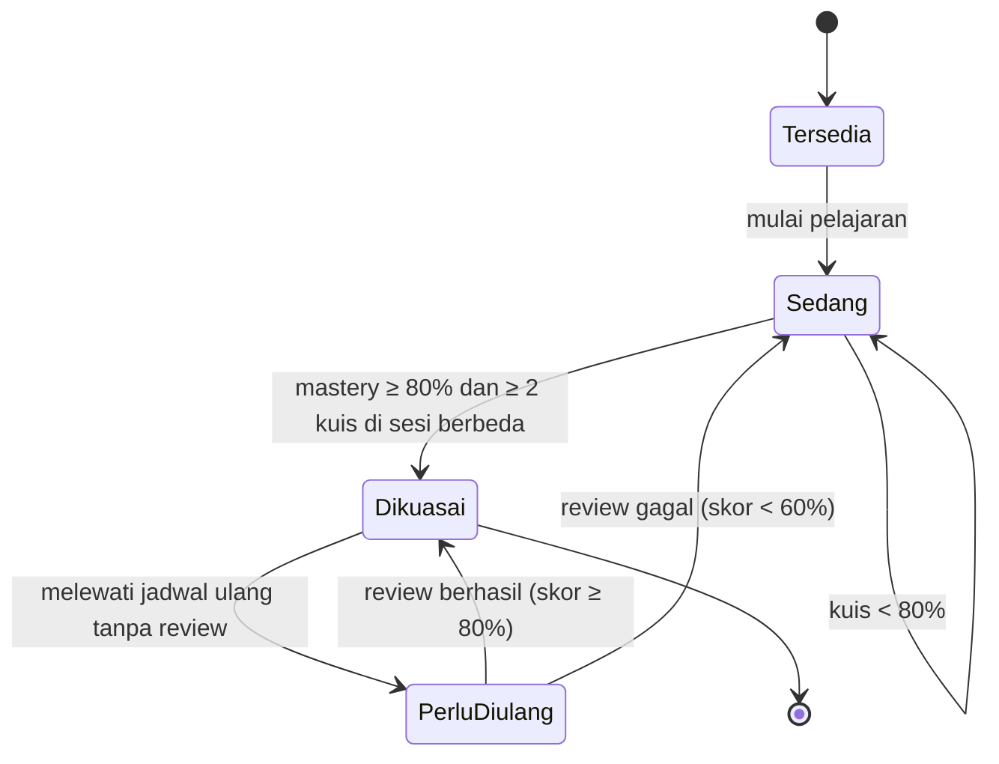

Konsep dengan prasyarat belum terpenuhi tetap berstatus **Tersedia** namun diberi penanda saran (tidak terkunci — lihat prinsip FR-02).

**Rumus mastery (versi awal, dapat dikalibrasi):**

```
skor_kuis        = (Σ poin_soal) / (jumlah soal)                    # 0..1
poin_soal        = 1.0 (benar tanpa petunjuk)
                   0.8 / 0.6 / 0.4 (benar dengan 1 / 2 / 3 petunjuk)
                   0.0 (salah)
mastery_baru     = mastery_lama + α × (skor_kuis − mastery_lama)    # α = 0.4 (EMA)
```

**Pengulangan berjarak (Leitner ringan):** kotak 1–5 dengan interval ulang 1, 3, 7, 14, 30 hari.
Skor ≥ 80% → naik satu kotak; skor < 60% → kembali ke kotak 1; di antaranya → tetap.
Bila `hari_ini > next_review + 3 hari`, mastery meluruh perlahan (mis. −2% per hari, minimum 50% dari nilai tertinggi) dan status menjadi **PerluDiulang**.

**Streak:** satu hari dihitung bila belajar ≥ 5 menit atau menyelesaikan ≥ 1 pelajaran. Terdapat **1 "hari libur gratis" per minggu**; hari kedua yang terlewat memutus streak.

**XP:** pelajaran selesai +20; kuis selesai +10 + (skor × 20); tantangan simulasi selesai +15; review tepat waktu +10. XP hanya dipakai untuk level profil dan lencana, bukan untuk peringkat publik.

### 10.9 Diagram urutan

**A. Belajar satu pelajaran (offline-first)**

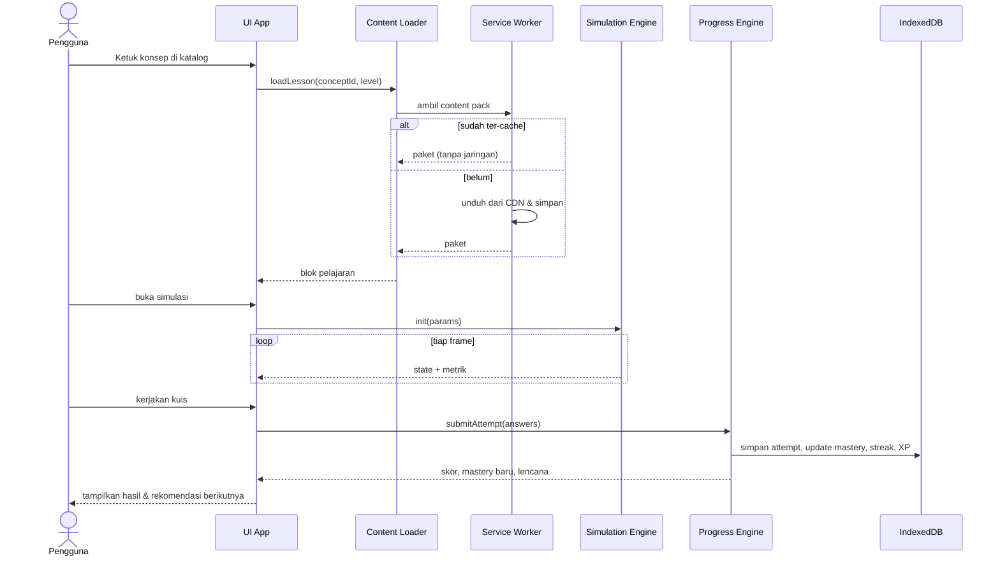

**B. Sinkronisasi (Fase 2)**

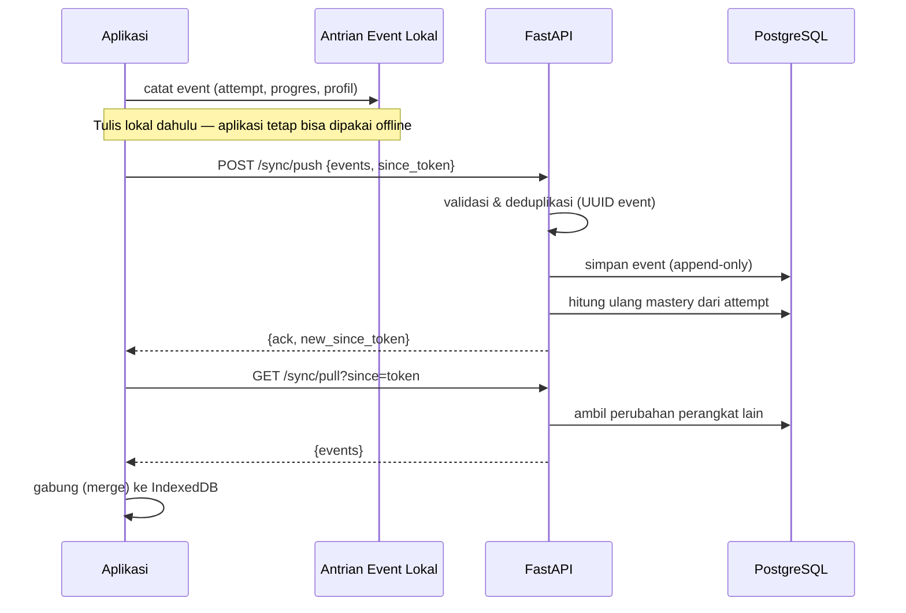

**Strategi penggabungan (merge):** *attempt* dan aktivitas bersifat **append-only** dengan UUID → digabung sebagai gabungan (union), tanpa konflik. Pengaturan profil memakai *last-write-wins* per kolom. Mastery selalu **dihitung ulang** dari riwayat attempt, bukan disinkronkan sebagai angka.

### 10.10 Antarmuka API (Fase 2)

| Metode | Endpoint | Fungsi |
|---|---|---|
| POST | `/auth/login`, `/auth/refresh`, `/auth/logout` | Autentikasi |
| GET | `/me` | Data akun |
| GET/POST/PATCH/DELETE | `/profiles` | Kelola profil keluarga |
| GET | `/content/manifest` | Versi dan daftar content pack |
| POST | `/sync/push` | Kirim event lokal |
| GET | `/sync/pull?since=` | Ambil perubahan |
| GET | `/progress/summary?profile_id=` | Ringkasan progres |
| DELETE | `/account` | Hapus akun & seluruh data (wajib untuk kebijakan Play) |
| GET | `/health` | Pemeriksaan layanan |

Semua endpoint di balik TLS; versi API di jalur (`/v1/...`); dokumentasi OpenAPI otomatis dari FastAPI.

### 10.11 Deployment & CI/CD

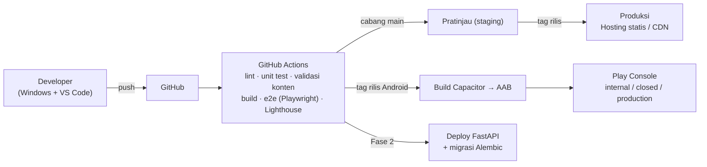

**Lingkungan:** `local` → `staging` (pratinjau tiap PR) → `production`. Versi konten dan versi aplikasi dirilis terpisah (konten dapat diperbarui tanpa merilis ulang aplikasi).

### 10.12 Keamanan & privasi

| Area | Kontrol |
|---|---|
| Data pengguna | Disimpan di perangkat pada MVP; tidak ada data pribadi wajib (nama panggilan cukup) |
| Data anak | Tidak ada iklan atau pelacak pihak ketiga; *parental gate* untuk tautan keluar & pengaturan; kumpulan data minimal |
| Transport | HTTPS wajib (Fase 2) |
| Autentikasi (Fase 2) | JWT berumur pendek + refresh token; kata sandi di-hash Argon2; OAuth Google sebagai opsi |
| Otorisasi | Setiap query difilter berdasarkan `account_id`; uji akses lintas-akun |
| Input | Validasi Pydantic; batas ukuran payload; rate limiting |
| Penghapusan data | Endpoint hapus akun + hapus data; ekspor data pengguna |
| Rantai pasok | Kunci versi dependensi; `npm audit`/Dependabot |
| Konten | Tidak menjalankan skrip pihak ketiga pada halaman pelajaran; CSP ketat |
| Kebijakan | Kebijakan privasi publik + formulir *Data safety* Play Store (Bagian 13) |

---

## 11. Analytics & Telemetri

**Prinsip:** privasi dulu. Pada MVP, statistik dicatat **hanya lokal** (dipakai untuk fitur progres/ringkasan mingguan); tidak ada data yang dikirim keluar. Pada fase Play Store, analytics dikirim hanya jika pengguna **opt-in**, dengan data teragregasi dan tanpa pengenal pribadi.

| Event | Properti | Tujuan |
|---|---|---|
| `app_open` | mode UI, profil (anonim) | Frekuensi pemakaian |
| `catalog_view` / `filter_used` | filter, level | Kegunaan katalog |
| `concept_open` | conceptId, level | Minat topik |
| `lesson_start` / `lesson_complete` | conceptId, level, durasi | Penyelesaian pelajaran |
| `story_panel_view` | storyId, jumlah panel | Keterlibatan cerita |
| `sim_start` / `sim_challenge_complete` | simId, percobaan | Nilai simulasi |
| `case_study_open` | csId | Minat studi kasus |
| `quiz_complete` | skor, petunjuk terpakai, durasi | Efektivitas pembelajaran |
| `mastery_up` / `review_due` | conceptId | Efektivitas pengulangan |
| `streak_extended` / `streak_broken` | panjang streak | Retensi |
| `placement_complete` | level hasil | Kalibrasi jalur |

**Pertanyaan yang dijawab data:** konsep mana yang paling sulit (skor terendah)? Di panel/langkah mana pengguna berhenti? Apakah pemakai simulasi mendapat skor kuis lebih tinggi? Apakah pengingat meningkatkan retensi?

---

## 12. Strategi Pengujian & QA

| Jenis | Cakupan | Alat |
|---|---|---|
| **Unit** | `progress-core` (mastery, streak, Leitner), integrator `sim-engine`, parser konten | Vitest |
| **Validasi numerik** | Simulasi vs solusi analitik (tabel 10.5) | Vitest (golden test) |
| **Validasi konten** | Skema, prasyarat tanpa siklus, `alt`/`explanation` wajib, tautan antar-konten | Zod + skrip build |
| **Komponen** | Katalog, kuis, penampil cerita, kontrol simulasi | Testing Library |
| **End-to-end** | Buka aplikasi → katalog → pelajaran → kuis → progres; alur offline; pindah profil | Playwright (viewport mobile) |
| **Performa** | TTI, ukuran bundle, fps simulasi di perangkat nyata kelas menengah | Lighthouse CI, profiling Chrome DevTools |
| **Aksesibilitas** | Kontras, label, urutan fokus, pembaca layar | axe-core, uji manual TalkBack/VoiceOver |
| **Kompatibilitas** | Android (Chrome), iPhone (Safari terpasang), beberapa ukuran layar | Perangkat nyata keluarga + emulator |
| **Migrasi data** | Naik versi skema IndexedDB tanpa kehilangan data | Uji otomatis dengan data contoh |
| **Uji pengguna** | Sesi 15–20 menit dengan anggota keluarga berbagai usia | Observasi + catatan temuan |
| **Backend (Fase 2)** | Endpoint, autentikasi, penggabungan sinkronisasi | pytest + basis data uji |

**Definition of Done — fitur:** kode ditinjau, uji unit/komponen hijau, uji e2e alur terkait hijau, tidak ada regresi Lighthouse melewati batas, aksesibilitas dasar terverifikasi, dokumentasi singkat diperbarui.

**Definition of Done — konten (per pelajaran):**
- [ ] Sesuai template 6.3 untuk levelnya
- [ ] Fakta & rumus diperiksa silang (min. 2 sumber) dan/atau ditinjau orang yang menguasai topiknya
- [ ] Simulasi terkait lulus validasi numerik
- [ ] Bank soal ≥ 2× jumlah soal tampil, semua punya penjelasan
- [ ] Studi kasus bersumber atau berlabel model/asumsi
- [ ] Gambar punya alt-text; lisensi aset tercatat
- [ ] Semua aset visual sesuai inventaris 6.9 (AI-generated, lolos quality gate gaya/resolusi/ukuran)
- [ ] Dicoba minimal satu pengguna sasaran

---

## 13. Distribusi: Keluarga → Play Store

### 13.1 Tahap A — Keluarga (MVP & Beta)

| Langkah | Keterangan |
|---|---|
| 1 | Deploy PWA ke hosting statis (HTTPS) |
| 2 | Kirim tautan ke anggota keluarga; pasang lewat **"Tambahkan ke Layar Utama"** (Chrome Android / Safari iPhone) |
| 3 | Ajarkan cara **ekspor cadangan** profil (penyimpanan browser dapat terhapus, terutama di iPhone jika aplikasi jarang dibuka) |
| 4 | Kumpulkan umpan balik mingguan (form singkat / percakapan) |
| Opsional | Bungkus dengan Capacitor → APK untuk dipasang langsung di Android keluarga |

### 13.2 Tahap B — Play Store

| Item | Rincian |
|---|---|
| **Akun developer** | Biaya pendaftaran sekali bayar (saat ini sekitar US$25 — verifikasi saat mendaftar) + verifikasi identitas |
| **Aturan pengujian akun personal baru** | Akun personal yang dibuat setelah 13 November 2023 wajib menjalankan **closed test dengan minimal 12 penguji yang opt-in terus-menerus selama 14 hari** sebelum dapat mengajukan akses produksi (akun organisasi dikecualikan tetapi butuh verifikasi organisasi). *Keluarga dan kerabat dapat menjadi penguji — rekrut 15–20 orang agar tidak ada risiko jam hitung mundur mengulang bila ada yang keluar.* Verifikasi persyaratan terkini di Play Console Help sebelum mulai |
| **Format rilis** | Android App Bundle (AAB) dengan Play App Signing |
| **Target API level** | Play mewajibkan aplikasi baru menargetkan level API Android yang cukup baru — cek persyaratan terkini saat rilis |
| **Kebijakan privasi** | URL publik wajib; jelaskan data yang dikumpulkan (idealnya: minimal) |
| **Formulir Data safety** | Isi sesuai data sebenarnya (akun, analytics opt-in, dsb.) |
| **Penilaian konten** | Isi kuesioner rating konten |
| **Target audiens** | Bila audiens mencakup anak-anak (di bawah 13 tahun), kebijakan **Families** berlaku dan ada persyaratan tambahan (tanpa iklan yang tidak sesuai, SDK yang disetujui, dsb.) — putuskan lebih awal (lihat Bagian 16) |
| **Hapus akun** | Bila ada pembuatan akun dalam aplikasi, sediakan jalur penghapusan akun & data |
| **Aset toko** | Ikon 512×512, *feature graphic* 1024×500, tangkapan layar (ponsel, disarankan tablet), deskripsi singkat/panjang bahasa Indonesia |
| **Pemantauan pasca-rilis** | Crash (Sentry/Play Console), ulasan, rating; siklus rilis konten berkala |

**Checklist kesiapan rilis Play Store:**
- [ ] Semua fitur *Must* + placement test + pengingat berfungsi stabil
- [ ] Akun, sinkronisasi, dan penghapusan akun berfungsi
- [ ] Kebijakan privasi dan Data safety selesai
- [ ] Keputusan target audiens & kebijakan Families selesai
- [ ] Aset dan lisensi seluruh konten terdokumentasi
- [ ] Closed test 14 hari selesai dengan ≥ 12 penguji
- [ ] Crash-free sessions ≥ 99% selama closed test

---

## 14. Roadmap & Milestone

*Asumsi estimasi: 1 pengembang paruh waktu (±15 jam/minggu). **Produksi konten (cerita, gambar, soal, studi kasus) kemungkinan besar lebih lama daripada pengembangan kode** — jadwal di bawah dapat bergeser sesuai kapasitas nyata.*

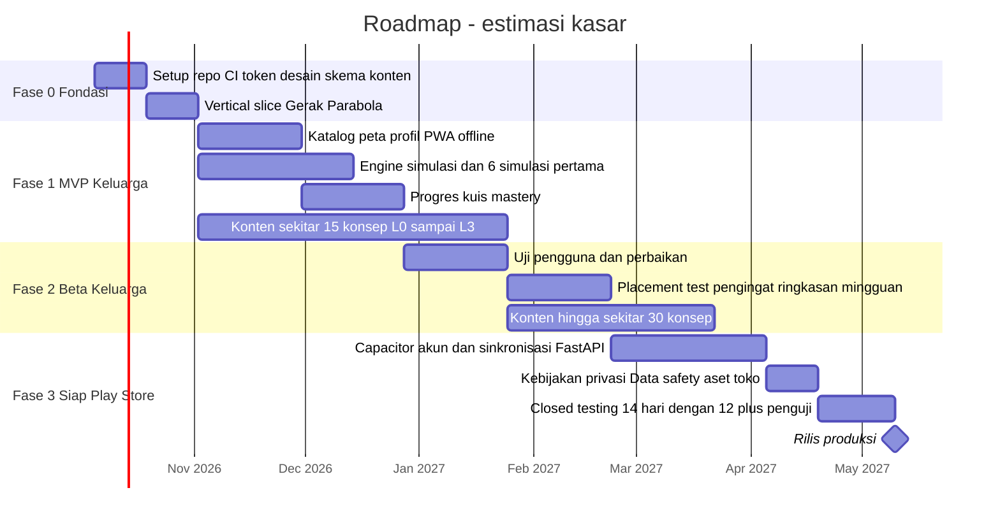

### Milestone & kriteria keluar

| Milestone | Cakupan | Kriteria keluar |
|---|---|---|
| **M0 — Fondasi** | Repo, CI, skema konten, token desain | CI hijau; validasi konten berjalan; halaman kosong dapat dipasang sebagai PWA |
| **M1 — Vertical slice** | 1 konsep lengkap (Gerak Parabola L1–L2): cerita → simulasi → studi kasus → kuis → progres | Anggota keluarga dapat menyelesaikan alur end-to-end di HP; simulasi lulus validasi numerik |
| **M2 — MVP Keluarga** | Semua fitur *Must*; ±15 konsep; 6 simulasi; 6 cerita; 5 studi kasus | Kriteria penerimaan FR-01…FR-09 terpenuhi; fitur berjalan offline; dipakai ≥ 3 anggota keluarga selama 2 minggu |
| **M3 — Beta Keluarga** | ±30 konsep; placement test; pengingat; ringkasan mingguan | Metrik aktivasi & retensi (3.4) tercapai atau diketahui penyebab kegagalannya |
| **M4 — Play-ready** | Capacitor, akun, sinkronisasi, kebijakan | Checklist 13.2 selesai; closed test 14 hari lulus |
| **M5 — Rilis** | Produksi di Play Store | Akses produksi disetujui; pemantauan aktif |

### Backlog fase lanjut (setelah M5)

- Konten L4–L5 (persamaan diferensial, aljabar linear, mekanika analitik, metode numerik)
- Sandbox Python (Pyodide) untuk eksperimen komputasi
- Simulasi 3D (Three.js)
- Bahasa Inggris dan bahasa daerah
- Teks-ke-suara untuk L0
- Tutor AI berbasis konten terverifikasi
- Kolaborasi guru/orang tua (laporan)
- CMS admin

---

## 15. Risiko & Mitigasi

| # | Risiko | Peluang | Dampak | Mitigasi |
|---|---|---|---|---|
| R1 | **Lingkup terlalu luas** (dua domain × enam level) | Tinggi | Tinggi | Vertical slice dulu; MoSCoW ketat; rilis per topik; L4–L5 ditunda; jangan menambah fitur sebelum M2 |
| R2 | **Produksi konten & ilustrasi lambat** (bottleneck terbesar) | Tinggi | Tinggi | Template pelajaran/naskah; tokoh & gaya visual tetap; komponen dipakai ulang; kapasitas konten dijadwalkan eksplisit; draf berbantuan AI **dengan** tinjauan manusia |
| R3 | **Kesalahan ilmiah pada konten/simulasi** | Sedang | Tinggi | Validasi numerik otomatis; pemeriksaan silang ≥ 2 sumber; tinjauan dosen/guru; label *model/asumsi* pada studi kasus; kanal laporan kesalahan dalam aplikasi |
| R4 | **Performa simulasi buruk di HP murah** | Sedang | Sedang | Fixed timestep; Web Worker; penurunan kualitas otomatis; uji di perangkat nyata kelas bawah sejak M1 |
| R5 | **Retensi rendah** (pengguna berhenti setelah beberapa hari) | Sedang | Tinggi | Pelajaran pendek (5–10 menit); progres & streak pemaaf; pengingat lembut; target keluarga; umpan balik mingguan |
| R6 | **Kebijakan Play (anak & data)** menghambat rilis | Sedang | Sedang | *Privacy by design*; putuskan target audiens lebih awal; tanpa pelacak pihak ketiga; baca kebijakan terkini sebelum Fase 3 |
| R7 | **Keterbatasan PWA di iPhone** (penyimpanan dapat dihapus, notifikasi perlu terpasang) | Sedang | Sedang | Ekspor/impor cadangan; edukasi "pasang ke layar utama"; iPhone bukan target Play Store |
| R8 | **Lisensi aset** (gambar, font, kutipan) | Sedang | Sedang | Aset buatan sendiri atau lisensi terbuka (CC0/OFL); daftar lisensi per aset; tidak menyalin ilustrasi buku/situs |
| R9 | **Kelelahan pengembang tunggal** | Sedang | Tinggi | Milestone kecil; definisikan MVP sempit; rayakan M1; sisakan ruang jeda |
| R10 | **Jalur "nol → ahli" membingungkan pengguna** | Sedang | Sedang | Placement test; "Lanjutkan belajar" menonjol; peta keterampilan; rekomendasi berikutnya di akhir pelajaran |
| R11 | **Pembelajaran tidak efektif** (hanya "hiburan") | Sedang | Tinggi | Ukur pre/post-test; tinjau soal dengan skor rendah; revisi konten berdasarkan data |

---

## 16. Asumsi & Pertanyaan Terbuka

### 16.1 Asumsi yang dipakai dalam draf ini

1. **Android dulu** sebagai jalur utama (keputusan 2 Okt 2026); iPhone via PWA opsional, bukan jalur utama. PWA-first tetap dipakai agar satu basis kode; APK via Capacitor disiapkan bila keluarga butuh.
2. Pengembang tunggal, paruh waktu, lingkungan Windows; nyaman dengan Python dan web.
3. Bahasa utama konten adalah Indonesia.
4. Tidak ada monetisasi pada v1.
5. Konten ditulis sendiri (dibantu alat), bukan disalin dari buku/situs berhak cipta.
6. Kurikulum resmi bukan acuan utama (jalur L0–L5 dirancang sendiri), tetapi dapat dipetakan ke kurikulum nasional bila diperlukan.

### 16.2 Pertanyaan yang perlu diputuskan

| # | Pertanyaan | Dampak keputusan |
|---|---|---|
| Q1 ✅ | Platform keluarga | **Diputuskan 2 Okt 2026: Android dulu.** Distribusi keluarga via PWA tautan; APK Capacitor bila perlu. iPhone via PWA opsional. |
| Q2 ✅ | Target usia | **Diputuskan 2 Okt 2026: segala usia**, termasuk anak <13. Konsekuensi: kebijakan **Families** Play Store berlaku (tanpa iklan tak sesuai, SDK disetujui, data minimal — lihat 13.2). Parental gate tetap wajib. |
| Q3 | Apakah ingin memetakan level ke kurikulum resmi (mis. Kurikulum Merdeka) atau mandiri? | Struktur graf prasyarat, penamaan level, kegunaan bagi pelajar sekolah |
| Q4 ✅ | Gaya visual | **Diputuskan 2 Okt 2026: flat vector ceria** (ala buku cerita anak Indonesia) sebagai gaya master semua level. Variasi antar-level hanya lewat "level dial" (kepadatan detail & palet, lihat 6.9) — bukan ganti gaya. |
| Q5 | Sampai level mana Anda sendiri dapat memvalidasi konten, dan siapa peninjau (dosen/guru/teman)? | Jaminan kualitas konten L3–L5 |
| Q6 | Apakah nyaman dengan React + TypeScript, atau lebih memilih Flutter/Vue? | Tumpukan teknologi lapisan UI |
| Q7 ✅ | Rencana monetisasi | **Sudah ada di Panduan v0.2 §7**: L0–L3 gratis selamanya; Family Pass sekali bayar (harga mikro) untuk L4–L5/sandbox; opsi lisensi sekolah. Validasi harga ke pengguna sebelum membangun billing. |
| Q8 | Seberapa penting fitur suara (narasi cerita untuk anak yang belum lancar membaca)? | Prioritas teks-ke-suara / rekaman audio |

---

## 17. Lampiran

### 17.1 Glosarium

| Istilah | Arti |
|---|---|
| **Konsep** | Unit pengetahuan terkecil yang dapat "dikuasai" (mis. Gerak Parabola); node pada peta keterampilan |
| **Tingkat kedalaman (L0–L5)** | Kedalaman penjelasan satu konsep, dari intuisi tanpa rumus sampai pemodelan/riset |
| **Pelajaran** | Isi satu konsep pada satu tingkat kedalaman |
| **Blok** | Bagian pelajaran: cerita, penjelasan, simulasi, studi kasus, kuis |
| **Peta keterampilan** | Graf konsep dan prasyaratnya beserta status penguasaan pengguna |
| **Mastery** | Perkiraan penguasaan pengguna atas suatu konsep (0–100%) |
| **Spaced repetition / Leitner** | Pengulangan dengan jarak yang meningkat agar ingatan bertahan |
| **Placement test** | Tes awal untuk merekomendasikan level mulai |
| **Content pack** | Paket konten hasil build (JSON + aset) yang diunduh per topik |
| **PWA** | *Progressive Web App*: aplikasi web yang dapat dipasang dan bekerja offline |
| **Capacitor** | Pembungkus yang mengubah aplikasi web menjadi aplikasi Android/iOS |
| **RK4** | Metode Runge–Kutta orde 4 untuk integrasi numerik persamaan diferensial |
| **Fixed timestep** | Langkah waktu simulasi tetap, terlepas dari frame rate layar |
| **Parental gate** | Penghalang sederhana (mis. soal hitung) agar anak tidak mengakses tautan keluar/pengaturan |
| **Local-first** | Data ditulis lokal dulu; sinkronisasi ke server bersifat menyusul |

### 17.2 Template naskah cerita bergambar (YAML)

```yaml
id: story-<slug>
title: "<judul>"
concept: <conceptId>
levels: [L0, L1]
characters: [kirana, kakek]
learningQuestion: "<pertanyaan yang dijawab lewat simulasi>"
panels:
  - id: p1
    image: /img/stories/<slug>/p1.webp
    alt: "<deskripsi gambar untuk pembaca layar>"
    caption: "<narasi singkat>"
    dialogue:
      - { who: kirana, text: "<ucapan>" }
    decision:               # opsional
      prompt: "<pertanyaan prediksi>"
      options: ["<A>", "<B>", "<C>"]
      linkSim: sim-projectile
  - id: p2
    ...
```

### 17.3 Template studi kasus industri

```
Judul:
Konsep terkait:                 (id konsep + level)
1. Konteks           — di mana/bagaimana masalah ini muncul (2–3 kalimat)
2. Masalah           — apa yang harus dipecahkan insinyur/ilmuwan
3. Konsep yang dipakai — hubungan ke pelajaran (dengan tautan)
4. Angka & model     — nilai/perhitungan; SETIAP angka: [sumber] atau [asumsi model]
5. Jadi Insinyur     — simulasi mini: pengguna mengatur parameter untuk memenuhi target desain
6. Dampak            — hasil di dunia nyata (keselamatan, efisiensi, biaya)
7. Karier terkait    — profesi & jalur belajar
8. Sumber            — daftar referensi
```

### 17.4 Template pelajaran (checklist penulis)

```
[ ] Hook cerita (komik) atau situasi nyata
[ ] Pertanyaan inti yang ingin dijawab
[ ] Intuisi tanpa rumus
[ ] Simulasi "Coba sendiri" + 1 tantangan
[ ] Konsep & rumus (sesuai level) + satuan
[ ] Contoh terpandu (min. 1)
[ ] Tautan ke studi kasus industri
[ ] Latihan (3–6 soal, petunjuk bertahap)
[ ] Kuis mastery (bank soal ≥ 2× tampil)
[ ] Ringkasan 3 poin + rekomendasi konsep berikutnya
[ ] Alt-text semua gambar; lisensi aset tercatat
[ ] Pemeriksaan silang fakta/rumus; validasi numerik simulasi
```

### 17.5 Langkah pertama yang direkomendasikan (30 hari awal)

1. Putuskan Q1, Q2, Q6 (Bagian 16) — menentukan jalur teknis dan kebijakan.
2. Siapkan repo monorepo, CI, dan skema konten (M0).
3. Bangun **satu** vertical slice: *Gerak Parabola* — cerita 6 panel (Bagian 6.7) + `sim-projectile` + 1 studi kasus + kuis 5 soal + progres.
4. Beri ke satu anggota keluarga di tiap kelompok usia; amati, catat, sesuaikan template sebelum memproduksi konten massal.

---

*Akhir dokumen — PRD v0.1*
